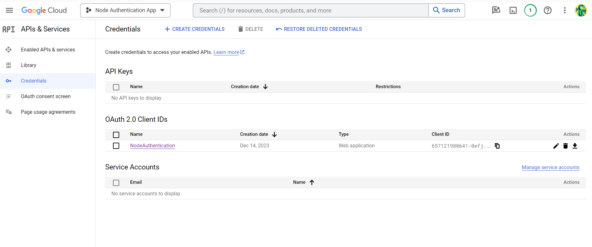
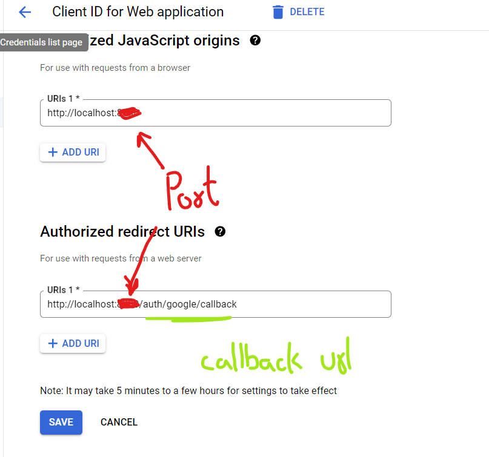

# NodeJs Authentication App

A complete user authentication app created for registering new users, loggin in for registered users, social sign up / login with google, reset password, forget password features.
It is build using NodeJs, ExpressJs, EJS , MongoDb , HTML, CSS, Javascript.

### 🔗 Hosted link:  

## ⚙️ Functionality 
- User signUp and signIn
- SignUp / SignIn using Google
- Forget User Password {password reset without sign in}
- Reset Password {password reset after sign in}
 
## 🧑‍💻 Getting started

* Fork the project 
* Clone the forked repository in your local system
* Setting
    * Google id and pass for Nodemailer Auth
        * setup your app password under 2-step security on google settings to get the password for Nodemailer auth pass.
    * Google Credentials setup for Passport-google-oauth Strategy
        * setup your google credentials on "https://console.cloud.google.com/apis/credentials"
            
        * setup your google oAuth 2.0 Client Id
            
        * After setting the above you will get your google client id & client secret for google oauth strategy.
    * Create .env file in the root directory and add the following:-
        * PORT ="Your port number"
        * SESSION_SECRET = "Your session secret key"
        * MONGODB_URL = "Your mongodb connection url "
        * NODEMAILER_AUTH_ID = "Your gmail id for nodemailer"
        * NODEMAILER_AUTH_PASS = "Your app password for nodemailer "
        * GOOGLE_CLIENT_ID = "Your google oauth client id"
        * GOOGLE_CLIENT_SECRET = "Your google oauth client secret"
        * GOOGLE_CALLBACK = "Your callback url for google authentication"
* Install all required packages
    npm install 
* Run project 
    npm start

The project will run on the port number provided by you.

## 🛠️ Tools Used 
- NodeJS
- MongoDB
- ExpressJS
- EJS

### 📚 Libraries: 
* connect-flash
* connect-mongo
* cookie-parser
* nodemailer
* path
* crypto
* bcrypt
* dotenv
* ejs
* express
* express-ejs-layout
* express-session
* mongoose
* passport
* passport-local
* passport-google-oauth

